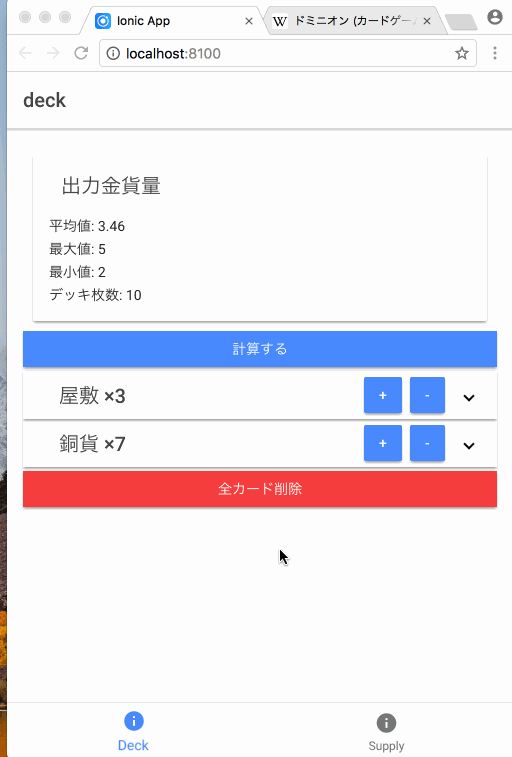

# Dominion cal



## What is it?
* 山札から5枚のカードを引いて手札にしたとき、その手札から何金出せるかの期待値を計算するionicアプリです。
* 現時点では+アクション,+ドロー,+金するアクションカードにしか対応していません。(礼拝堂や鉱山のようなカードには対応していません)
* まだ作りかけです
* ionicで作られています。詳細は以下を参照してください
<https://ionicframework.com/docs/>

## Usage

### Run In Browser

require ionic

```
$ npm install -g ionic cordova
```

run in browser

```
$ ionic serve
```

or 

```
$ ionic cordova run browser
```

### Run as iOS or Android application

See https://ionicframework.com/docs/intro/deploying/

## 今後やりたいこと

* 期待値の計算部分が重すぎて計算中に画面が固まるので、マルチスレッド化して画面が固まらないようにしたい。(Service Workerとか使うといけるらしい？)
* ~~平均値だけでなく、中央値とか、何ならヒストグラムとか作りたい。(安定して生産力を出せるデッキなのか、瞬間火力はすごいけど不安定なデッキなのか・・とかわかるようになりそう)~~ →　対応した